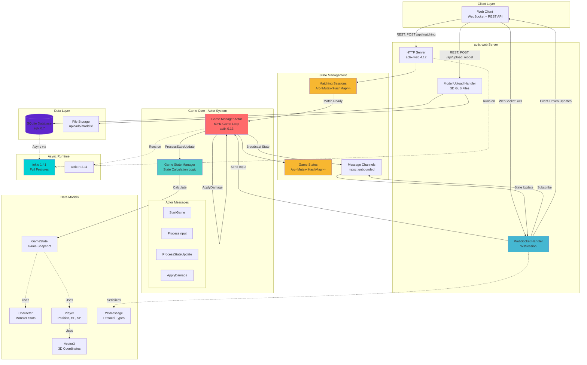

# 3D Real-time Battle Game Server

actix-webで実装した3Dリアルタイム対戦ゲームのサーバーです。

## 🎯 概要

2人対戦型の3Dリアルタイムバトルゲーム用サーバー

## ✨ 機能

### プレイヤーマッチング

- マッチング作成・参加
- マッチング一覧取得・リアルタイム更新
- マッチング成功通知
- キャラクター選択・準備完了
- ゲーム開始通知

### ゲーム進行管理

- リアルタイム操作入力受信（移動・攻撃・回転）
- ゲーム状態計算・配信
- 勝敗判定・ゲーム終了通知
- 戦績データ管理

## 🚀 クイックスタート

### 前提条件

- Rust 1.70以降
- Cargo

### ビルド & 起動

## 🚀 デプロイメント

### 概要

- **トリガー**: `release`ブランチへのマージ（`main`へのPRマージで自動的に`release`へ同期・デプロイ）
- **デプロイ方法**: GitHub Actions + Teleport Machine ID (OIDC)
- **デプロイ先**: `ct108` (Teleport経由)

### デプロイフロー

1. **開発**: `feature/*` ブランチで開発し、`main` にプルリクエストを作成・マージ。
2. **リリース**: `main` から `release` ブランチへPRを作成・マージ。
3. **自動デプロイ**: GitHub Actionsが起動し、Teleport OIDC認証を経てサーバーにデプロイを実行。

### ロールバック

```bash
# ローカルマシンから実行（Teleport認証が必要）
export DEPLOY_USER=your-username
./scripts/rollback.sh
```

## 📡 API仕様

### REST API

マッチング機能はWebSocketに移行しました。REST APIは主にリソース管理に使用します。

#### 3Dモデル一覧取得

```bash
GET /api/models

# Response
{
  "monsters": [
    {
      "monster_id": "uuid",
      "name": "warrior",
      "is_used": false  # 一度使用されたモデルはtrueになり、再使用不可
    }
  ]
}
```

### WebSocket

#### 接続

```bash
# ローカル開発環境
ws://localhost:8080/ws

# 本番環境
wss://uma-mon.localhouse.jp/ws
```

※ `player_id` や `matching_id` のクエリパラメータは不要になりました。

#### マッチングフロー

1. **接続**: サーバーに接続すると、自動的にロビーに参加します。
2. **一覧受信**: `UpdateMatchings` メッセージで待機中のマッチング一覧をリアルタイム受信します。
3. **作成**: `CreateMatching` を送信してマッチングを作成します。
4. **参加**: `JoinMatch` を送信して既存のマッチングに参加します。
5. **成立**: 両プレイヤーに `MatchingEstablished` が通知されます。

#### ゲーム進行

- **状態更新**: 従来の60Hzサーバー配信から、**イベント駆動型**に変更されました。クライアントが `StateUpdate` または `Input` を送信したタイミングでのみ、相手に `OpponentStateUpdate` が通知されます。
- **勝敗判定**: サーバー内部では引き続き60Hzでゲームループが回り、タイムアウトや勝敗判定を行っています。

#### メッセージ型

**クライアント → サーバー:**
- `CreateMatching` - マッチング作成 `{ "username": "Name" }`
- `JoinMatch` - マッチング参加 `{ "matching_id": "uuid" }`
- `Ready` - キャラクター選択 `{ "selected_model_id": "uuid" }`
- `StateUpdate` - 位置・回転の同期（移動時のみ送信）
- `Input` - アクション入力（攻撃など）

**サーバー → クライアント:**
- `MatchingCreated` - 作成完了通知
- `UpdateMatchings` - マッチング一覧更新（ロビー全員にブロードキャスト）
- `MatchingEstablished` - マッチング成立
- `OpponentCharacterSelected` - 相手のキャラ選択情報
- `GameStart` - ゲーム開始
- `OpponentStateUpdate` - 相手の状態更新
- `GameEnd` - ゲーム終了

詳細は [WebSocketメッセージ仕様](doc/websocket-messages.md) を参照。

## 🧪 テスト

### 自動テスト

```bash
# ロジックテスト
cargo test --test matching_logic_test

# WebSocketテスト
cargo test --test websocket_test

# モデル使用テスト
cargo test --test model_usage_test

# 全テスト実行
cargo test
```

### 手動テスト

詳細な手順は [テスト手順書](doc/testing-guide.md) を参照。

## 🏗️ アーキテクチャ

### システム構成図



### 技術スタック

- **actix-web** - HTTPサーバー
- **actix-web-actors** - WebSocketサポート
- **actix** - アクターモデル
- **tokio** - 非同期ランタイム
- **sqlx** - データベース操作 (SQLite)
- **Teleport** - セキュアなインフラアクセス

### 設計のポイント

#### イベント駆動型状態同期

ネットワーク帯域を節約するため、常時配信を廃止し、状態変化があった場合のみ通信を行うイベント駆動型アーキテクチャを採用しました。これにより通信量が約90%削減されています。

#### モデルの使い切り運用

ゲーム性を高めるため、一度の対戦で使用された3Dモデル（モンスター）は「使用済み」となり、次の対戦では選択できなくなります。

## 🌐 本番環境

本番環境で API をテストする場合:

```bash
# REST API
curl -X POST https://uma-mon.localhouse.jp/api/models/upload \
  -F "file=@test.glb" \
  -F 'monster_data={"name":"テストモンスター","max_hp":100,"short_range_attack_power":15,"long_range_attack_power":10,"defense_power":12,"move_speed":150,"attack_range":250,"attack_cooldown":150,"size_type":"MEDIUM"}'

# WebSocket接続
wscat -c "wss://uma-mon.localhouse.jp/ws"

# スクリプトでのテスト
API_BASE_URL=https://uma-mon.localhouse.jp ./scripts/test_api.sh
```

## 📚 参考資料

- [仕様書](doc/specification.md)
- [テスト手順書](doc/testing-guide.md)
- [WebSocketメッセージ仕様](doc/websocket-messages.md)
- [マッチング詳細フロー](doc/matching_flow.md)
- [actix-web公式ドキュメント](https://actix.rs/)
