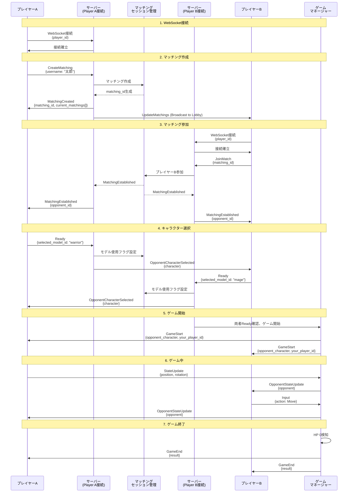
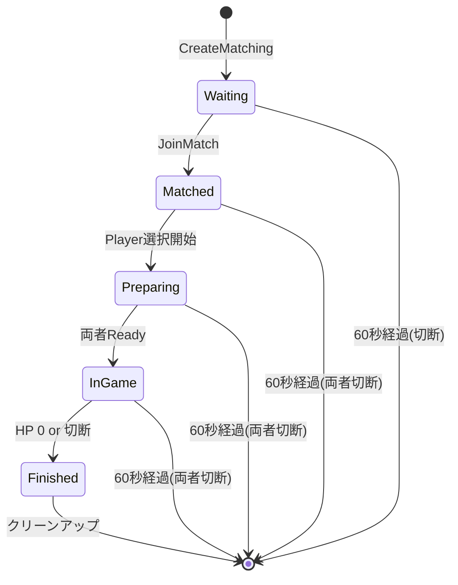

# マッチングシステムの詳細フロー

このドキュメントでは、WebSocketベースのマッチングシステムの完全な流れを説明します。

## 概要フロー図



## 詳細フロー

### 1. WebSocket接続

#### 1.1 接続リクエスト

**エンドポイント:** `ws://server/ws?player_id={id}&matching_id={id}`

**クエリパラメータ:**
- `player_id` (必須): プレイヤーの一意識別子
  - 指定がない場合、サーバーがUUIDを自動生成
- `matching_id` (オプション): 既存のマッチングに再接続する場合に指定

**コード:** [websocket.rs:754-783](../src/handlers/websocket.rs#L754-L783)

#### 1.2 接続時の処理

1. **WsSessionの作成**
   - データベースプール
   - マッチングセッション管理
   - WebSocketチャンネル管理
   - 待機中プレイヤー管理
   - ゲームマネージャー参照

2. **player_idの設定**
   - クエリパラメータから取得
   - なければUUID生成

3. **matching_idが指定されている場合**
   - セッションの有効性チェック（`is_valid()`）
   - 無効な場合はエラーを返す
   - 有効な場合、`last_active_at`をクリア（再接続タイマー解除）
    - `WsChannels`に登録
    - `matching_id`がない場合、`LobbyPlayers`に登録

**コード:** [websocket.rs:784-808](../src/handlers/websocket.rs#L784-L808)

---

### 2. マッチング作成

#### 2.1 クライアントからのリクエスト

```json
{
  "type": "CreateMatching",
  "data": {
    "username": "太郎"
  }
}
```

**パラメータ:**
- `username` (Option<String>): 作成者のユーザー名（省略可能）

#### 2.2 サーバー側の処理

**コード:** [websocket.rs:89-159](../src/handlers/websocket.rs#L89-L159)

1. **MatchingSessionの作成**

   ```rust
   let session = MatchingSession::new_with_username(
       player_id_clone.clone(),
       username.clone(),
   );
   ```

   - 新しいUUIDを生成（`matching_id`）
   - ステータスを`Waiting`に設定
   - `creator_username`を保存
   - `player_a`を設定

2. **セッション管理への保存**

   ```rust
   sessions_lock.insert(matching_id, session);
   ```

3. **待機リストへの追加**

   ```rust
   waiting_players_lock.insert(player_id_clone, (matching_id, tx));
   ```

4. **現在のマッチング一覧を取得**

   ```rust
   let current_matchings: Vec<MatchingInfo> = waiting_players_lock
       .iter()
       .filter(|(pid, _)| *pid != &player_id_clone)
       .filter_map(|(_, (mid, _))| {
           sessions_lock.get(mid).map(|session| MatchingInfo {
               matching_id: *mid,
               creator_username: session.creator_username.clone(),
               created_at: session.created_at,
               status: session.status.clone(),
           })
       })
       .collect();
   ```

#### 2.3 サーバーからのレスポンス

```json
{
  "type": "MatchingCreated",
  "data": {
    "matching_id": "a1b2c3d4-...",
    "current_matchings": [
      {
        "matching_id": "e5f6g7h8-...",
        "creator_username": "花子",
        "created_at": "2025-11-22T14:00:00Z",
        "status": "Waiting"
      }
    ],
    "timestamp": "2025-11-22T14:30:00Z"
  }
}
```

#### 2.4 他の待機中プレイヤーへの通知

`broadcast_update_matchings()`が自動的に呼ばれ、すべての待機中プレイヤー（`WaitingPlayers`）およびロビー待機プレイヤー（`LobbyPlayers`）に`UpdateMatchings`メッセージが送信されます。

**コード:** [websocket.rs:161-191](../src/handlers/websocket.rs#L161-L191)

---

### 3. マッチング参加

#### 3.1 クライアントからのリクエスト

```json
{
  "type": "JoinMatch",
  "data": {
    "matching_id": "a1b2c3d4-..."
  }
}
```

#### 3.2 サーバー側の処理

**コード:** [websocket.rs:193-294](../src/handlers/websocket.rs#L193-L294)

1. **バリデーション**
   - マッチングセッションが存在するか確認
   - ステータスが`Waiting`か確認
   - 同じプレイヤーIDでないか確認

2. **プレイヤーBの設定**

   ```rust
   session.player_b = Some(Player::new(player_id_clone.clone()));
   session.status = MatchingStatus::Matched;
   ```

3. **待機リストから削除**
   - プレイヤーAを待機リストから削除
   - プレイヤーBを待機リストから削除

4. **WsChannelsへの登録**

   ```rust
   let mut channels = ws_channels.lock().unwrap();
   let player_map = channels.entry(matching_id).or_default();
   player_map.insert(player_a_id.clone(), sender_a);
   player_map.insert(player_b_id.clone(), sender_b);
   ```

#### 3.3 両プレイヤーへの通知

```json
{
  "type": "MatchingEstablished",
  "data": {
    "matching_id": "a1b2c3d4-...",
    "opponent_id": "player_b",
    "model_data": null,
    "timestamp": "2025-11-22T14:30:01Z"
  }
}
```

#### 3.4 他の待機中プレイヤーへの通知

`broadcast_update_matchings()`が自動的に呼ばれ、すべての待機中プレイヤーおよびロビー待機プレイヤーに`UpdateMatchings`メッセージが送信されます（参加したマッチングが一覧から消えます）。

**コード:** [websocket.rs:343-345](../src/handlers/websocket.rs#L343-L345)

---

### 4. キャラクター選択（Ready）

#### 4.1 クライアントからのリクエスト

```json
{
  "type": "Ready",
  "data": {
    "selected_model_id": "warrior_001"
  }
}
```

#### 4.2 サーバー側の処理

**コード:** [websocket.rs:296-577](../src/handlers/websocket.rs#L296-L577)

1. **モデルの検証（非同期）**

   ```rust
   match Model3D::find_by_id(&db_pool, &model_id).await {
       Ok(Some(model)) => {
           if model.is_used {
               // エラー: モデルは既に使用済み
           }
           Model3D::mark_as_used(&db_pool, &model_id).await?;
       }
       Ok(None) => {
           // エラー: モデルが見つからない
       }
   }
   ```

2. **プレイヤーのキャラクター設定**

   ```rust
   let character = Character::new(model_id.clone());
   if session.player_a.id == player_id {
       session.player_a.character = Some(character.clone());
       session.player_a.ready = true;
   } else if player_b.id == player_id {
       player_b.character = Some(character.clone());
       player_b.ready = true;
   }
   ```

3. **相手への通知**

   ```json
   {
     "type": "OpponentCharacterSelected",
     "data": {
       "character": {
         "model_id": "warrior_001",
         "position": {"x": 0, "y": 0, "z": 0},
         "rotation": {"x": 0, "y": 0, "z": 0},
         "hp": 100,
         "max_hp": 100
       },
       "timestamp": "2025-11-22T14:30:02Z"
     }
   }
   ```

---

### 5. ゲーム開始

#### 5.1 両者準備完了の判定

**コード:** [websocket.rs:413-545](../src/handlers/websocket.rs#L413-L545)

```rust
if session.is_both_ready() {
    session.status = MatchingStatus::InGame;
    session.is_battle_started = true;

    // GameStateManagerの作成
    let game = GameStateManager::new(
        matching_id,
        player_a_id,
        player_b_id,
        player_a_char,
        player_b_char,
    );

    // GameManagerに送信
    game_manager.do_send(StartGame { game, ws_senders });
}
```

#### 5.2 両プレイヤーへのGameStartメッセージ

**プレイヤーAへ:**

```json
{
  "type": "GameStart",
  "data": {
    "opponent_character": {
      "model_id": "mage_001",
      "position": {"x": 0, "y": 0, "z": 0},
      "rotation": {"x": 0, "y": 0, "z": 0},
      "hp": 100,
      "max_hp": 100
    },
    "your_player_id": "player_a",
    "timestamp": "2025-11-22T14:30:03Z"
  }
}
```

**プレイヤーBへ:**

```json
{
  "type": "GameStart",
  "data": {
    "opponent_character": {
      "model_id": "warrior_001",
      ...
    },
    "your_player_id": "player_b",
    "timestamp": "2025-11-22T14:30:03Z"
  }
}
```

---

### 6. ゲーム中の処理

#### 6.1 状態更新（StateUpdate）

**クライアントからサーバーへ:**

```json
{
  "type": "StateUpdate",
  "data": {
    "position": {"x": 10.0, "y": 0.0, "z": 5.0},
    "rotation": {"x": 0.0, "y": 45.0, "z": 0.0}
  }
}
```

**サーバー側の処理:**

**コード:** [websocket.rs:601-621](../src/handlers/websocket.rs#L601-L621)

```rust
self.game_manager.do_send(ProcessStateUpdate {
    matching_id: *matching_id,
    player_id: player_id.clone(),
    position,
    rotation,
});
```

**GameManagerでの処理:**

**コード:** [game/manager.rs:59-86](../src/game/manager.rs#L59-L86)

```rust
// 相手のプレイヤーにのみ状態を送信
fn send_opponent_state_for_player(&self, matching_id: &Uuid, player_id: &str) {
    if let Some(player_map) = channels.get(matching_id) {
        if is_player_a {
            // Player Aが更新 -> Player Bに送信
            if let Some(sender_b) = player_map.get(&player_b_id) {
                let msg = WsMessage::OpponentStateUpdate {
                    opponent: state.player_a.clone(),
                    timestamp: Utc::now(),
                };
                sender_b.send(msg);
            }
        }
    }
}
```

**相手プレイヤーへの通知:**

```json
{
  "type": "OpponentStateUpdate",
  "data": {
    "opponent": {
      "model_id": "warrior_001",
      "position": {"x": 10.0, "y": 0.0, "z": 5.0},
      "rotation": {"x": 0.0, "y": 45.0, "z": 0.0},
      "hp": 100,
      "max_hp": 100
    },
    "timestamp": "2025-11-22T14:30:05Z"
  }
}
```

#### 6.2 入力処理（Input）

**クライアントからサーバーへ:**

```json
{
  "type": "Input",
  "data": {
    "action": {
      "Move": {
        "direction": {"x": 1.0, "y": 0.0, "z": 0.0},
        "speed": 5.0
      }
    }
  }
}
```

または

```json
{
  "type": "Input",
  "data": {
    "action": {
      "Attack": {
        "target_position": {"x": 15.0, "y": 0.0, "z": 10.0}
      }
    }
  }
}
```

**サーバー側の処理:**

**コード:** [websocket.rs:579-599](../src/handlers/websocket.rs#L579-L599)

```rust
self.game_manager.do_send(ProcessInput {
    matching_id: *matching_id,
    input: PlayerInput {
        player_id: player_id.clone(),
        action,
        timestamp: Utc::now(),
    },
});
```

---

### 7. ゲーム終了

#### 7.1 終了条件の検知

**GameManagerでの処理:**

**コード:** [game/manager.rs:108-176](../src/game/manager.rs#L108-L176)

```rust
// 60Hz（16ms間隔）でゲーム状態を更新
ctx.run_interval(Duration::from_millis(TICK_INTERVAL_MS), move |act, _ctx| {
    for (matching_id, state) in act.games.iter_mut() {
        // HPチェック
        if !state.player_a.is_alive() || !state.player_b.is_alive() {
            let winner_id = if state.player_a.is_alive() {
                &state.player_a_id
            } else {
                &state.player_b_id
            };

            let result = GameResult {
                matching_id: *matching_id,
                winner_id: winner_id.clone(),
                // ...
            };

            act.broadcast_game_end(matching_id, result);
        }
    }
});
```

#### 7.2 両プレイヤーへの通知

```json
{
  "type": "GameEnd",
  "data": {
    "result": {
      "matching_id": "a1b2c3d4-...",
      "winner_id": "player_a",
      "loser_id": "player_b",
      "player_a_id": "player_a",
      "player_b_id": "player_b",
      "play_time_seconds": 120,
      "finished_at": "2025-11-22T14:32:03Z"
    },
    "timestamp": "2025-11-22T14:32:03Z"
  }
}
```

#### 7.3 セッションの無効化

```rust
let mut sessions = act.sessions.lock().unwrap();
if let Some(session) = sessions.get_mut(matching_id) {
    session.is_battle_finished = true;
}
```

---

### 8. 切断処理

#### 8.1 プレイヤーの切断

**コード:** [websocket.rs:632-669](../src/handlers/websocket.rs#L632-L669)

1. **待機リストから削除**

   ```rust
   waiting_players.remove(player_id);
   ```

2. **他の待機中プレイヤーに通知**

   ```rust
   self.broadcast_update_matchings();
   ```

3. **WsChannelsから削除**

   ```rust
   if let Some(player_map) = channels.get_mut(&matching_id) {
       player_map.remove(player_id);
       if player_map.is_empty() {
           channels.remove(&matching_id);
           is_empty = true;
       }
   }
   ```

4. **すべてのプレイヤーが切断した場合**

   ```rust
   if is_empty {
       session.last_active_at = Some(Utc::now());
   }
   ```

   - 60秒のタイマーが開始される
   - 60秒以内に誰かが再接続すれば、タイマーはクリアされる
   - 60秒経過すると、`GameManager`のクリーンアップタスクがセッションを削除

#### 8.2 自動クリーンアップ

**コード:** [game/manager.rs:108-176](../src/game/manager.rs#L108-L176)

```rust
// 1秒ごとに実行
ctx.run_interval(Duration::from_secs(1), move |act, _ctx| {
    let mut sessions = act.sessions.lock().unwrap();
    sessions.retain(|matching_id, session| {
        if !session.is_valid() {
            println!("🗑️ Removing expired matching session: {}", matching_id);
            false
        } else {
            true
        }
    });
});
```

**セッションの有効性判定:**

**コード:** [models.rs:127-144](../src/models.rs#L127-L144)

```rust
pub fn is_valid(&self) -> bool {
    // バトル終了後は無効
    if self.is_battle_finished {
        return false;
    }

    // 両方切断してから60秒経過したら無効
    if let Some(last_active) = self.last_active_at {
        let now = Utc::now();
        let duration = now.signed_duration_since(last_active);
        if duration.num_seconds() > 60 {
            return false;
        }
    }

    true
}
```

---

## マッチングステータスの遷移



**ステータスの定義:**

**コード:** [models.rs:85-92](../src/models.rs#L85-L92)

- `Waiting`: マッチング待ち（プレイヤーAのみ）
- `Matched`: マッチング成立（プレイヤーA、B両方参加）
- `Preparing`: 準備中（キャラクター選択中）
- `InGame`: ゲーム中
- `Finished`: 終了

---

## 重要なデータ構造

### WaitingPlayers

```rust
```rust
HashMap<String, (Uuid, mpsc::UnboundedSender<WsMessage>, Uuid)>
// Key: player_id
// Value: (matching_id, WebSocketチャンネル, session_id)
```

### LobbyPlayers

```rust
HashMap<String, (mpsc::UnboundedSender<WsMessage>, Uuid)>
// Key: player_id
// Value: (WebSocketチャンネル, session_id)
```

### MatchingSessions

```rust
HashMap<Uuid, MatchingSession>
// Key: matching_id
// Value: マッチングセッション
```

### WsChannels

```rust
HashMap<Uuid, HashMap<String, (mpsc::UnboundedSender<WsMessage>, Uuid)>>
// Key: matching_id
// Value: { player_id: (WebSocketチャンネル, session_id) }
```

---

## まとめ

このマッチングシステムは以下の特徴を持っています：

1. **リアルタイム通信**: WebSocketで低遅延通信
2. **状態管理**: セッション、待機リスト、チャンネルを適切に管理
3. **再接続対応**: 60秒以内の再接続を許可
4. **自動クリーンアップ**: 無効なセッションを自動削除
5. **モデル管理**: 3Dモデルの1回限りの使用を保証
6. **詳細情報**: マッチング一覧にユーザー名、作成時刻、ステータスを含む
